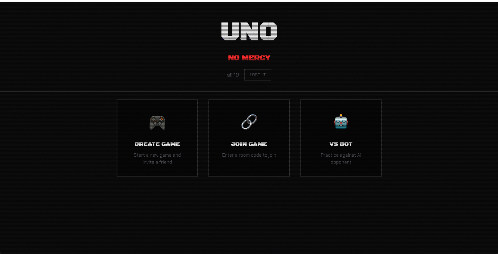
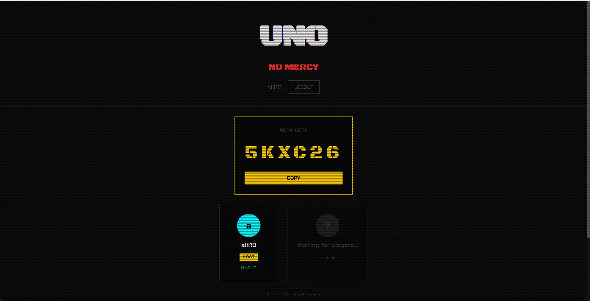

# Open Mercy

A real-time multiplayer card game with a brutal stacking ruleset. Play online with friends or battle a ruthless AI - all from your browser.

**Play now:** [open-mercy.com](https://open-mercy.com)

## Why this exists

The ruleset popularized by Mattel's UNO Show 'Em No Mercy® never got a proper digital version. Open Mercy brings every chaotic rule - Draw 6, Draw 10, Skip Everyone, Discard All, Color Roulette, hand swaps on 7, hand rotations on 0 - into a fast, playable web game. No downloads, no app stores.

> Open Mercy is an independent project. It is not affiliated with, endorsed by, or associated with Mattel or the UNO® brand. Card game rules are not copyrightable; the name, art, and trade dress here are our own.

## What it does

- **No login required** - click "Play Now" and you're in a game in seconds. Guest players get full access via anonymous auth.
- **Real-time multiplayer** - create a room, share a code, play with 2-10 players. Works for guests and registered users alike.
- **VS Bot** - single-player mode against an AI opponent
- **Playable by AI agents** - the game exposes [WebMCP](#playing-as-an-ai-agent-webmcp) tools, so an AI agent can discover and play a seat just by visiting the page
- **Full ruleset** - every card type implemented faithfully, including the brutal ones
- **7-card swap is optional** - choose to swap hands or keep your own
- **Mobile responsive** - playable on phones (320px+), tablets, and desktops
- **Password reset** - forgot password flow with email recovery
- **Supabase backend** - auth (including anonymous), game state, and real-time sync via Supabase Realtime
- **Cloudflare proxy** - optional Cloudflare Worker to bypass regional Supabase blocks

### Cards included

| Card | Effect |
|------|--------|
| Skip Everyone | Skip all other players |
| Draw 6 / Draw 10 | Force massive draws (stackable) |
| Reverse Draw 4 | Reverse direction AND +4 |
| Color Roulette | Victim draws until they hit the chosen color |
| Discard All | Play every card of the matching color at once |
| 7 - Swap | Swap hands with any player (or keep your hand) |
| 0 - Rotate | All hands rotate in play direction |

## Tech stack

| Layer | Tech |
|-------|------|
| Frontend | Vue 3 + TypeScript + Vite |
| Styling | CSS (custom industrial/cyberpunk theme) |
| State | Pinia |
| Animations | GSAP |
| Cards | Programmatic SVG generation (no image assets needed) |
| Auth + DB + Realtime | Supabase |
| Proxy (optional) | Cloudflare Workers |

## Project structure

```
.
├── frontend/                # Vue 3 SPA
│   ├── src/
│   │   ├── components/      # Vue components (game/, auth, lobby, landing)
│   │   ├── composables/     # Shared logic (screen size, sounds, animations)
│   │   ├── stores/          # Pinia stores (game, multiplayer, auth)
│   │   ├── utils/           # Game rules, card generator, helpers
│   │   └── types/           # TypeScript types
│   └── index.html
├── supabase-proxy/          # Cloudflare Worker (optional)
├── cards/                   # Reference card images
├── cards-svgs/              # Reference card SVGs
└── cards-images/            # Reference card renders
```

## Getting started

### Prerequisites

- Node.js 18+
- A [Supabase](https://supabase.com) project (free tier works)

### 1. Clone and install

```bash
git clone https://github.com/alii13/open-mercy.git
cd open-mercy/frontend
npm install
```

### 2. Set up Supabase

1. Create a project at [supabase.com](https://supabase.com)
2. Copy your project URL and anon key from **Settings > API**
3. Enable **anonymous sign-ins** under **Authentication > Settings** (required for guest play)
4. Set the **Site URL** under **Authentication > URL Configuration** to your deploy URL (e.g. `https://open-mercy.com`)
5. Create your env file:

```bash
cp .env.example .env
```

4. Fill in your credentials:

```env
VITE_SUPABASE_URL=https://your-project-ref.supabase.co
VITE_SUPABASE_ANON_KEY=your-anon-key-here
```

### 3. Run locally

```bash
npm run dev
```

Open [http://localhost:5173](http://localhost:5173). That's it.

### 4. Build for production

```bash
npm run build
npm run preview   # test the production build locally
```

### Deploy to Cloudflare Pages

The production site runs on [Cloudflare Pages](https://pages.cloudflare.com).

**Option A: CLI deploy**

```bash
cd frontend
npm run build
npx wrangler pages deploy dist --project-name uno-no-mercy   # Pages project name predates the rebrand
```

**Option B: GitHub auto-deploy**

1. Go to [Cloudflare Dashboard > Pages](https://dash.cloudflare.com/?to=/:account/pages)
2. Create a project and connect your GitHub repo
3. Set build configuration:
   - **Build command:** `npm run build`
   - **Build output directory:** `dist`
   - **Root directory:** `frontend`
4. Add environment variables:
   - `VITE_SUPABASE_URL` - your Supabase project URL
   - `VITE_SUPABASE_ANON_KEY` - your Supabase anon key
5. Every push to `main` auto-deploys

### Supabase proxy (optional)

If Supabase is blocked in your region, the `supabase-proxy/` directory contains a Cloudflare Worker that proxies all traffic through Cloudflare's network.

```bash
cd supabase-proxy
npm install
# Update wrangler.toml with your Supabase project ref
npx wrangler dev       # local dev
npx wrangler deploy    # deploy to Cloudflare
```

Then add to your frontend `.env`:
```env
VITE_SUPABASE_PROXY_URL=https://uno-supabase-proxy.your-subdomain.workers.dev
```

## Playing as an AI agent (WebMCP)

The game exposes itself as [WebMCP](https://github.com/webmachinelearning/webmcp) tools, so an AI agent can discover and play it just by visiting the page - the same way a human would, with the same information and no special access.

### How it works

On load, the app registers a set of tools on the browser's `document.modelContext` (the W3C Web Model Context API, provided by the mcp-b polyfill). A WebMCP-capable agent - an agentic browser or extension - reads these tools automatically. The tools are thin wrappers over the game's existing Pinia stores, so the agent drives exactly the same code your clicks do. There is no separate game engine to keep in sync, and no rules are reimplemented.

The agent plays in a loop:

1. `wait_for_turn` - block until it's the agent's turn or a decision is needed
2. `get_state` - read the table and the legal moves
3. call a move tool (e.g. `play_card`) chosen from `legal_moves`
4. repeat until the game is finished

### What the agent sees

`get_state` returns only what a human player sees - its own hand and the public table. Opponent hands and the draw-pile order are never exposed.

```jsonc
{
  "mode": "single",
  "status": "PLAYING",
  "whose_turn": "you",
  "your_hand": [
    { "id": "card-12", "color": "green", "type": "number", "value": 7 },
    { "id": "card-40", "color": "wild",  "type": "draw4" }
  ],
  "top_card":      { "color": "green", "type": "skip" },
  "current_color": "green",
  "direction": 1,
  "draw_stack": 0,
  "opponents": [ { "id": "p-1", "name": "Terminator", "card_count": 5 } ],
  "required_action": {
    "action": "play_or_draw",
    "options": {
      "playable": [ { "id": "card-12", "type": "number", "value": 7, "needs_color": false } ],
      "can_draw": true
    }
  },
  "should_call_mercy": false
}
```

Because `legal_moves` is precomputed from the real rules, an agent cannot make an illegal move and needs no prior knowledge of the game to play correctly. `required_action` names the decision due now, and a `how_to_play` tool provides the rules and basic tactics for stronger play.

### Tools

| Group | Tools |
|-------|-------|
| Info  | `how_to_play`, `get_state`, `wait_for_turn` |
| Start | `start_single_player`, `create_multiplayer_game`, `join_multiplayer_game`, `start_multiplayer_game` |
| Moves | `play_card`, `draw_card`, `pick_wild_color`, `call_uno` (the last-card call, shown as MERCY! in the UI), `swap_hands`, `skip_swap`, `set_roulette_color`, `select_discard_all_top` |
| Exit  | `leave_game` |

### Surfaces

The same tools are exposed three ways:

- **`document.modelContext`** - the native W3C API a standards-capable agent reads on visit (primary).
- **mcp-b `TabServerTransport`** - an in-page MCP server over `postMessage`, for mcp-b clients and browser extensions.
- **`window.__unoMcp`** (name predates the rebrand) - a dependency-free `{ listTools, callTool }` bridge for headless drivers and debugging.

The WebMCP layer lives in `frontend/src/mcp/`, and the MCP SDK is lazily loaded so it does not add to the bundle a normal player downloads.

## Screenshots

### Lobby
Create a game, join with a room code, or play against the AI.



### Waiting room
Share the room code and wait for players to join.



## Contributing

Contributions welcome. See [CONTRIBUTING.md](CONTRIBUTING.md) for guidelines.

Some areas that could use help:

- **Spectator mode** - watch games in progress
- **Game history / replays** - review past games
- **More AI strategies** - smarter bot opponents
- **Sound design** - better audio effects
- **Accessibility** - screen reader support, keyboard navigation
- **Localization** - translate to other languages

## License

[MIT](LICENSE)
